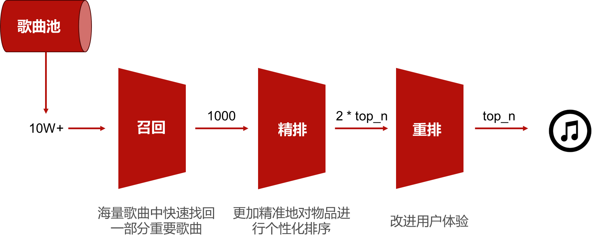
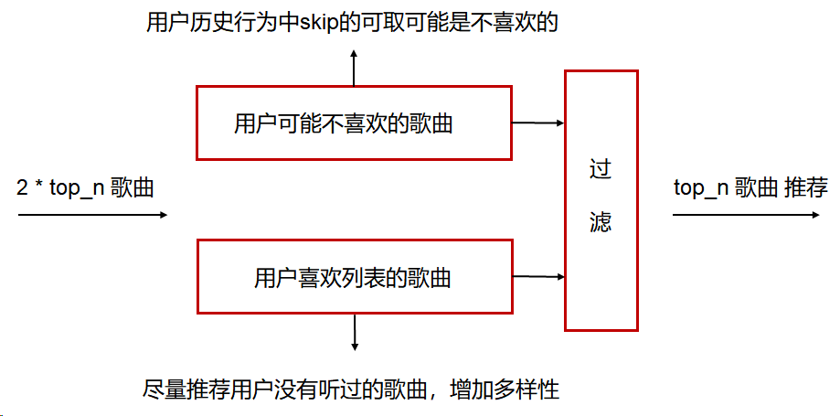

# 基于大数据的MIR(音乐推荐)系统

> **四川大学 软件学院 IT企业实训 scu2024b-team01**
>
> **成都上程数据有限公司**

小组成员

- 王俊博
- 文昱涵
- 余月
- 刘劲见

## 0. 项目介绍

本项目基于大数据技术，完成对音乐的数据分析和可视化，并针对用户的听歌习惯，结合机器学习算法，完成音乐的智能推荐。数据集来自于Last.fm。我们完成了数据仓库建立、数据分析、数据可视化、推荐算法设计与实现、web应用实现与部署等内容。

## 1. 项目总览

### 1.1 项目首页

### 1.2 排行榜页面

### 1.3 数据可视化

#### 可视化地图

<video src="readme.assets/可视化地图.mp4"></video>

#### 听众年龄、订阅类型分布图

<video src="readme.assets/听众年龄订阅类型分布图.mp4"></video>

#### 其他可视化视图

### 1.4 音乐推荐算法

整体架构

召回模型

多路找回模型

精排模型

重排模型

## 2. 技术栈

开发语言：`Python` `HTML5` `css` `Javascript` `Node.js`

前端:  `Vue.js` `Element+`  `Axios`

后端:  `FastAPI`

